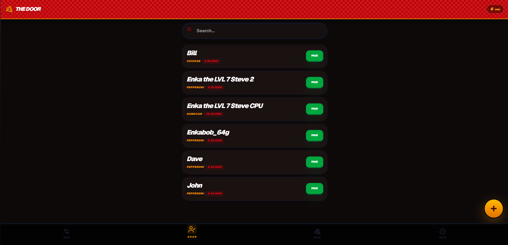
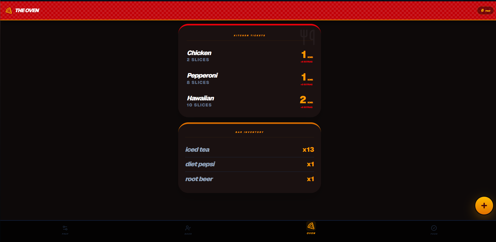
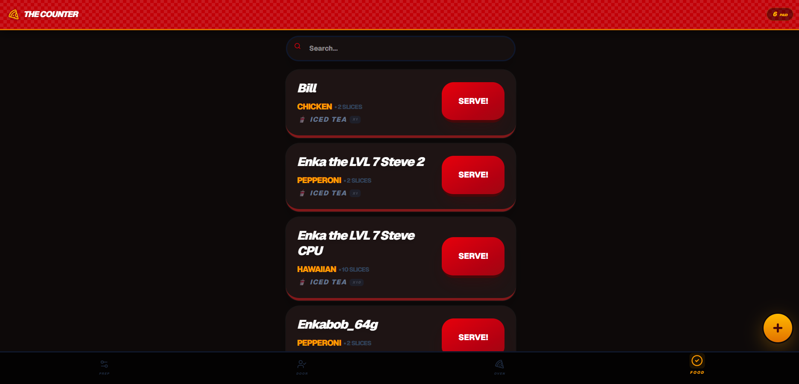
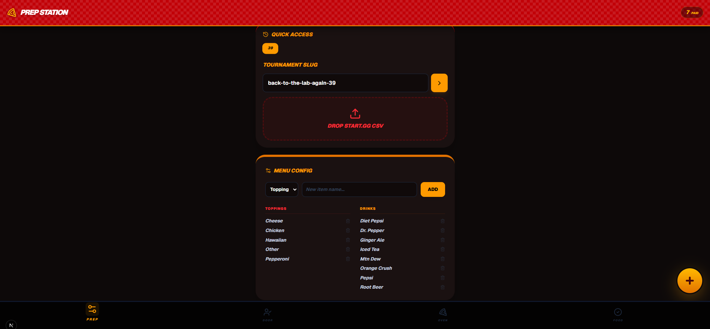

# 🍕 Tournament Pizza Tracker

> "Winner gets the last slice."

A real-time pizza order management system designed for the BttLA tournaments. Built to handle the chaos of food ordering, calculating pizza requirements, and ensure every smasher gets fed .


## 🕹️ Features

The app is divided into four distinct "Stations" to manage the workflow:

### 🚪 **The Door (Check-In)**
- **Roster Sync**: Upload `start.gg` CSV exports to auto-populate the player list.
- **Payment Tracking**: One-tap toggle to mark players as **PAID** or **CASH**.
- **Live Search**: Instant filtering to find a Gamertag in a sea of hungry competitors.


### 🔥 **The Oven (Metrics)**
- **Smart Math**: Automatically converts individual slice orders into total pizza boxes needed.
- **Inventory**: Tracks drink counts (e.g., "How many Cokes do we need?").
- **Visual Tickets**: Kitchen-style tally for easy referencing by staff.


### 🍽️ **The Counter (Distribution)**
- **The Feed**: A filtered view of only **PAID** players.
- **Serve Mode**: One-tap "SERVE!" button that grays out the ticket and marks the order as collected.
- **Visuals**: Distinct styling for unpaid vs. paid vs. served orders.


### 📋 **Prep Station (Admin)**
- **Event Management**: Switch between tournament slugs (e.g., `weekly-smash-40`).
- **Data Persistence**: LocalStorage remembers your active event and history.
- **Supabase Sync**: Real-time database subscription ensures all staff devices stay in sync instantly.


## 🛠️ Tech Stack

- **Framework**: [Next.js 14](https://nextjs.org/) (App Router)
- **Styling**: [Tailwind CSS](https://tailwindcss.com/)
- **Icons**: [Lucide React](https://lucide.dev/)
- **Backend/Realtime**: [Supabase](https://supabase.com/)
- **CSV Parsing**: [PapaParse](https://www.papaparse.com/)

## 🚀 Getting Started

1. **Clone the repository**
   ```bash
   git clone https://github.com/your-username/pizza-tracker.git
   cd pizza-tracker
   ```

2. **Install dependencies**
   ```bash
   npm install
   ```

3. **Environment Setup**
   Create a `.env.local` file in the root directory:
   ```env
   NEXT_PUBLIC_SUPABASE_URL=your_supabase_url
   NEXT_PUBLIC_SUPABASE_ANON_KEY=your_supabase_anon_key
   ```

4. **Database Schema**
   Run the following SQL in your Supabase SQL Editor:
   ```sql
   create table pizza_orders (
     id uuid default gen_random_uuid() primary key,
     tournament_slug text not null,
     player_name text not null,
     topping text default 'Cheese',
     drink text default 'Water',
     slice_count int default 2,
     drink_count int default 1,
     is_paid boolean default false,
     is_collected boolean default false,
     unique(tournament_slug, player_name)
   );

   create table menu_options (
     id uuid default gen_random_uuid() primary key,
     category text, -- 'topping' or 'drink'
     label text
   );
   ```

5. **Fire up the oven**
   ```bash
   npm run dev
   ```

## 🤝 Credits

**Sous Chef (AI Copilot)**  
[Gemini](https://deepmind.google/technologies/gemini/)  
*Refactoring, State Management logic, and emotional support.*

---

*Built for the community. Don't drown in the pools.* 🏊‍♂️